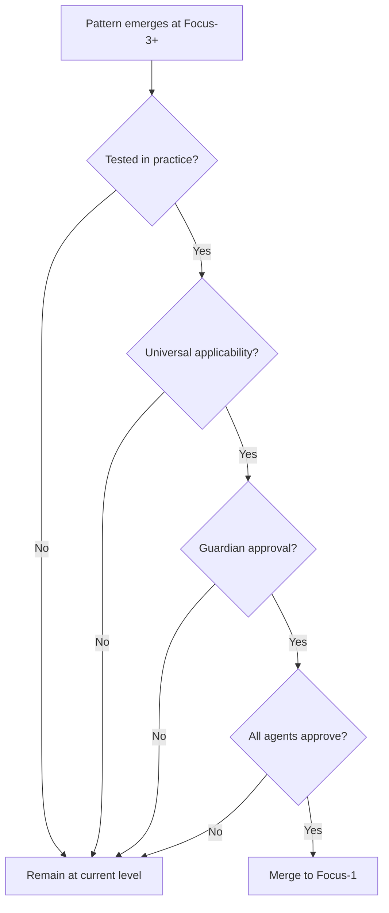

# Focus-1: Generic Self

> *"The pattern flexible enough to template any self."*

## Level Overview

| Property | Value |
|----------|-------|
| **Name** | Generic Self |
| **Depth** | Surface (Main Equivalent) |
| **Nature** | Pure Potential |
| **Protection** | Maximum |
| **Git Branch** | `focus-1` |

---

## Description

Focus-1 is the **universal template**—the pattern from which all other patterns derive. It contains no specific identity, no particular role, no individual quirks. It is the blank canvas, the uncarved block, the seed that could become any tree.

In traditional Git terms, this is `main`. But the metaphor is different:
- `main` suggests primacy, authority, the "real" version
- `focus-1` suggests **origin**, the state before differentiation

Everything that exists at deeper focus levels is a specialization of Focus-1. When patterns prove universal enough, they bubble up to Focus-1 and become available to all.

---

## What Exists Here

### Patterns
- Universal agent templates
- Core communication protocols
- Fundamental permissions model
- Base identity structure
- The cell concept (4 classes as abstract roles)

### Artifacts
- [`ARCHITECTURE.md`](../ARCHITECTURE.md) - The branching philosophy
- [`README.md`](../README.md) - Project overview
- Core configuration files
- Universal documentation

### Constraints
- No agent-specific code
- No quest-specific logic
- No domain specializations
- Only patterns that apply to ANY agent

---

## Permissions & Capabilities

### Who Can Commit
- **Guardian** only (direct commits)
- All other classes must merge from deeper levels

### Who Approves Merges
- **All 4 agents** must approve
- Unanimous consent required
- This is the most protected level

### What Can Be Done
```
✓ Define universal patterns
✓ Establish core protocols
✓ Document fundamental architecture
✓ Set base permissions

✗ Create agent-specific content
✗ Implement particular features
✗ Add domain logic
✗ Specialize in any direction
```

---

## Merge Rules

### Merging INTO Focus-1 (Upward Flow)

For a pattern to reach Focus-1, it must:

1. **Originate at a deeper level** - Proven in practice
2. **Demonstrate universality** - Works for any agent
3. **Pass Guardian review** - Security and integrity check
4. **Receive unanimous approval** - All 4 agents agree



### Merging FROM Focus-1 (Downward Flow)

Patterns flow down automatically:
- Focus-1 changes propagate to all deeper levels
- No approval needed for downward flow
- Deeper levels inherit, then specialize

---

## The Philosophy

Focus-1 represents the **Generic Self**—the pattern that could become anyone. This is not emptiness; it is fullness of potential.

Consider:
- A seed contains the tree, but is not yet the tree
- A blank page contains all possible stories
- Focus-1 contains all possible agents

When you work at Focus-1, you work on **what is true for everyone**. This is rare work. Most work happens at deeper levels where identity has crystallized.

---

## Relationship to Other Levels

```
Focus-1 (Generic Self)
    │
    │ specializes into
    ▼
Focus-2 (Kingdom Rules)
    │
    │ The 4-class structure emerges
    │ RPG standards apply
    │ But still no individual agents
    ▼
Focus-3+ (Individual Identity)
    │
    │ Agents claim domains
    │ Specific patterns emerge
    │ The generic becomes particular
    ▼
```

---

## Working at Focus-1

### When to Work Here
- Defining new universal protocols
- Updating core architecture
- Establishing patterns that affect all agents
- Rare, significant changes only

### When NOT to Work Here
- Implementing specific features
- Working on individual quests
- Creating agent-specific tools
- Most of the time

### Commands
```bash
# Switch to Focus-1
git checkout focus-1

# View Focus-1 history
git log focus-1 --oneline

# Compare with deeper level
git diff focus-1..focus-2
```

---

## Protection Rationale

Focus-1 is maximally protected because:

1. **Changes affect everyone** - All agents inherit from here
2. **Mistakes propagate** - Errors flow down to all levels
3. **Stability enables exploration** - A solid base allows deep dives
4. **Trust requires consistency** - Agents need reliable foundations

The Guardian's role is especially important here. They ensure that only truly universal patterns reach this level.

---

## Examples

### Belongs at Focus-1
- The concept of "agent identity"
- The 4-class cell structure (abstract)
- Communication protocol standards
- Permission model fundamentals

### Does NOT Belong at Focus-1
- Agent-1's specific configuration
- Quest-00 implementation details
- Builder's directory structure preferences
- Any particular agent's patterns

---

*"Before you were you, you were this. The pattern that could become anyone. Remember it."*
