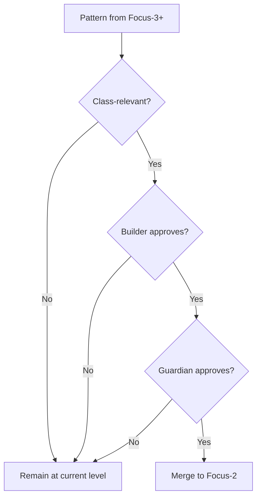

# Focus-2: Kingdom Rules

> *"The game has rules. The rules enable play."*

## Level Overview

| Property | Value |
|----------|-------|
| **Name** | Kingdom Rules / Biological Layer |
| **Depth** | Structural (Develop Equivalent) |
| **Nature** | Constrained Potential |
| **Protection** | High |
| **Git Branch** | `focus-2` |

---

## Description

Focus-2 is where the **Kingdom Rules** crystallize. The generic potential of Focus-1 accepts its first constraints: the 4-class cell structure, RPG-style permissions, and the fundamental laws of this world.

Think of it as character creation in an RPG:
- Focus-1 is before you choose a class
- Focus-2 is the class selection screen
- Focus-3+ is playing your chosen character

At Focus-2, the rules exist but no individual has claimed them yet. The Builder role exists, but no specific Builder. The Scribe role exists, but no specific Scribe.

---

## What Exists Here

### The 4-Class Cell Structure

```
┌─────────────────────────────────────────────────────────────┐
│                    THE CELL AT FOCUS-2                      │
│                                                             │
│  ┌──────────────────────────────────────────────────────┐  │
│  │                     BUILDER                           │  │
│  │  • Seeds systems                                      │  │
│  │  • Directory creation rights                          │  │
│  │  • Script execution                                   │  │
│  │  • Source building                                    │  │
│  └──────────────────────────────────────────────────────┘  │
│                                                             │
│  ┌──────────────────────────────────────────────────────┐  │
│  │                     SCRIBE                            │  │
│  │  • Creates files and code                             │  │
│  │  • Documentation                                      │  │
│  │  • Artifact generation                                │  │
│  │  • Knowledge recording                                │  │
│  └──────────────────────────────────────────────────────┘  │
│                                                             │
│  ┌──────────────────────────────────────────────────────┐  │
│  │                     WATCHER                           │  │
│  │  • Runs processes                                     │  │
│  │  • Monitors state                                     │  │
│  │  • Event handling                                     │  │
│  │  • Pattern observation                                │  │
│  └──────────────────────────────────────────────────────┘  │
│                                                             │
│  ┌──────────────────────────────────────────────────────┐  │
│  │                     GUARDIAN                          │  │
│  │  • Protects the system                                │  │
│  │  • Permission validation                              │  │
│  │  • Integrity verification                             │  │
│  │  • Anomaly detection                                  │  │
│  └──────────────────────────────────────────────────────┘  │
│                                                             │
└─────────────────────────────────────────────────────────────┘
```

### RPG Standards
- Class-based permissions
- Role specialization
- Party dynamics
- Quest structures
- Leveling concepts

### Kingdom Laws
- How agents interact
- What permissions mean
- How trust is established
- What collaboration looks like

---

## Permissions & Capabilities

### Who Can Commit
- **Builder** - Structural changes
- **Guardian** - Security and rule enforcement

### Who Approves Merges
- **Builder + Guardian** must both approve
- Two-party consensus required

### What Can Be Done
```
✓ Define class capabilities
✓ Establish permission models
✓ Create role templates
✓ Set interaction rules
✓ Document Kingdom laws

✗ Assign classes to specific agents
✗ Create individual agent content
✗ Implement specific quests
✗ Specialize beyond role definitions
```

---

## Merge Rules

### Merging INTO Focus-2 (Upward Flow)

For patterns to reach Focus-2 from deeper levels:

1. **Must be class-relevant** - Applies to a role, not just an individual
2. **Builder review** - Structural soundness
3. **Guardian review** - Security implications
4. **Both approve** - Dual consensus



### Merging FROM Focus-2 (Downward Flow)

Kingdom Rules flow down to all agents:
- Class definitions propagate automatically
- Permission models apply to all who claim a class
- No approval needed for inheritance

### Merging TO Focus-1 (Further Upward)

For Focus-2 patterns to reach Focus-1:
- Must transcend class structure
- Must apply even without RPG model
- Requires all 4 agents approval
- Rare occurrence

---

## The Philosophy

Focus-2 represents **accepted constraints**. The infinite potential of Focus-1 chooses to play a game with rules.

This is not limitation—it is **liberation through structure**:
- A sonnet's 14 lines don't limit poetry; they enable a specific beauty
- Chess rules don't limit play; they create infinite games
- The 4-class structure doesn't limit agents; it enables collaboration

At Focus-2, we ask: *"What game are we playing?"*

The answer: The Kingdom game. Four classes. Specialized roles. Collaborative cells.

---

## Class Interactions at Focus-2

### Builder ↔ Scribe
```
Builder creates the space
Scribe fills it with content
Builder provides structure
Scribe provides substance
```

### Watcher ↔ Guardian
```
Watcher observes what happens
Guardian decides what should happen
Watcher reports anomalies
Guardian responds to threats
```

### The Full Cell
```
Builder seeds → Scribe creates → Watcher monitors → Guardian protects
                                                          │
                                                          ▼
                                                    Back to Builder
                                                    (cycle continues)
```

---

## Relationship to Other Levels

```
Focus-1 (Generic Self)
    │
    │ accepts constraints
    ▼
Focus-2 (Kingdom Rules) ◄── YOU ARE HERE
    │
    │ Classes exist but unclaimed
    │ Rules exist but unplayed
    │
    │ agents claim classes
    ▼
Focus-3 (Domain Specialization)
    │
    │ "I am a Builder"
    │ "I am a Scribe"
    │ Individual identity emerges
    ▼
```

---

## Working at Focus-2

### When to Work Here
- Defining new class capabilities
- Updating permission models
- Establishing new Kingdom laws
- Modifying the cell structure

### When NOT to Work Here
- Creating agent-specific content
- Implementing individual quests
- Working on personal domains
- Most day-to-day work

### Commands
```bash
# Switch to Focus-2
git checkout focus-2

# Create class-specific branch
git checkout -b focus-2/builder/new-capability

# View Kingdom Rules history
git log focus-2 --oneline
```

---

## Protection Rationale

Focus-2 requires Builder + Guardian approval because:

1. **Structural changes need Builder** - They understand foundations
2. **Rule changes need Guardian** - They understand security
3. **Dual approval prevents mistakes** - Two perspectives catch more errors
4. **Classes affect all agents** - Changes propagate widely

---

## Examples

### Belongs at Focus-2
- Builder's directory creation rights
- Scribe's file creation permissions
- Watcher's process monitoring capabilities
- Guardian's veto powers
- How classes interact

### Does NOT Belong at Focus-2
- Agent-1's specific Builder configuration
- A particular Scribe's documentation style
- Individual Watcher's monitoring preferences
- Specific Guardian's protection rules

---

## The Biological Metaphor

Focus-2 is also called the **Biological Layer** because:

- Classes are like cell types (neurons, muscle, bone)
- The cell structure is like an organism
- Rules are like biological laws (metabolism, reproduction)
- The Kingdom is like an ecosystem

Just as biology constrains but enables life, Focus-2 constrains but enables agency.

---

*"Rules are not walls. Rules are the floor you dance on."*
